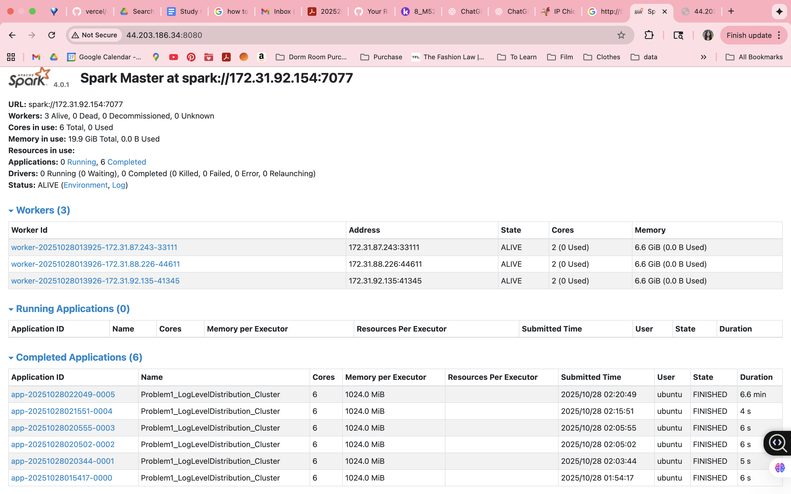
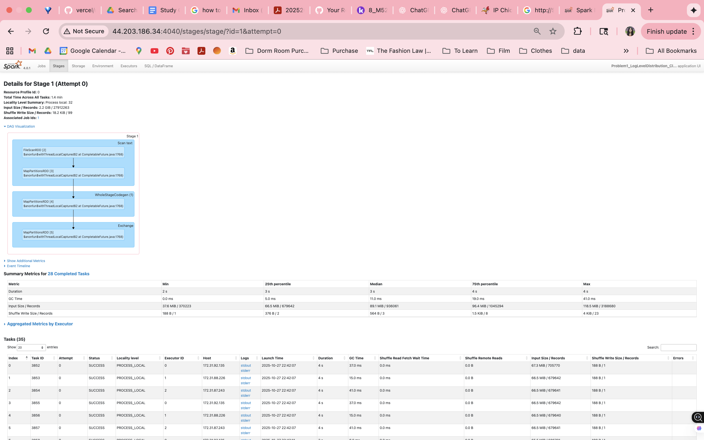

# Spark Log Analysis – Problem 1 Report

**Approach of Problem** 
The analysis was performed using **PySpark** on a distributed **4-node AWS Spark cluster** (1 master and 3 worker nodes).  
The script (`problem1.py`) reads all text log files from my S3 bucket and extracts log levels such as INFO, WARN, ERROR, and DEBUG to summarize their distribution across all Spark applications.

Before deploying to the cluster, I first tested my implementation locally on the EC2 instance using a smaller subset of the log data stored under `data/sample/`.  
Running the job locally helped me debug and validate the Spark logic, particularly the **regular expression (regex)** used to extract log levels.  

Initially, I encountered issues where the regex pattern did not correctly match log lines, resulting in empty CSV outputs. By iteratively testing and refining the expression, I was able to accurately capture log levels and verify the parsing results through incremental output checks (e.g., counts of each log type, sample previews).  

After confirming correctness locally, I scaled up the script to run on the full dataset in the cluster environment using the `s3a://` protocol for S3 access. This allowed Spark to read logs in parallel across all worker nodes, significantly improving processing performance and reducing runtime.

**Key Insights and Patterns** 

Total log lines processed: 33236604
Total lines with log levels: 27410250
Unique log levels found: 3

Log level distribution:
  ERROR :     11,183 (  0.04%)
  INFO  : 27,389,472 ( 99.92%)
  WARN  :      9,595 (  0.04%)

The overwhelming majority of log lines were **INFO**, consistent with normal Spark execution logs. This is because engineers are inclined to have progress checks in the form of info loglines. Only a very small proportion (< 0.1 %) of entries were warnings or errors, indicating a generally healthy cluster. No DEBUG-level logs were found in the provided dataset, suggesting those messages were disabled in production configuration.

**Performance and Execution Observations** 

- **Total log lines processed:** ≈ 33.2 million  
- **Lines with valid log levels:** ≈ 27.4 million  
- **Execution time:** ~ 6.6 minutes on the cluster  
- **Total files read:** ≈ 3,852 container logs from 194 applications  

Spark executed the job in several stages: reading from S3, parsing via regex, aggregating, and writing results.  
The Spark Web UI confirmed full cluster utilization across all three worker nodes.  

**Optimizations Used** 
- Switched from `s3://` → `s3a://` for proper S3 access. I had to extensively debug this issue for a while. 
- Enabled Hadoop AWS and AWS SDK packages to allow distributed S3 reads.  
- Used DataFrame API (instead of RDDs) for vectorized computation.  
- Wrote results to local disk on master node to minimize network overhead.

Comprehensive analysis of findings (20 points)
Clear description of approach for each problem
Discussion of cluster usage patterns and trends
Performance analysis (15 points)
Execution time observations
Optimization strategies employed
Comparison of local vs cluster performance
Documentation quality (10 points)
Screenshots of Spark Web UI showing job execution
Well-formatted markdown with clear sections
Professional presentation

# Spark Log Analysis – Problem 2 Report
