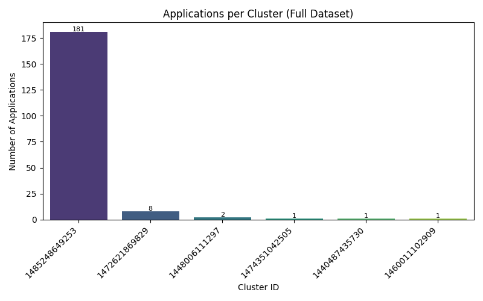
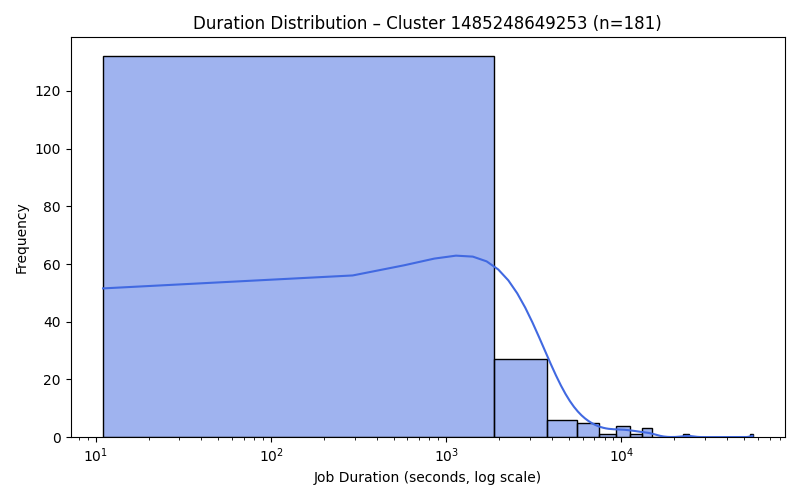
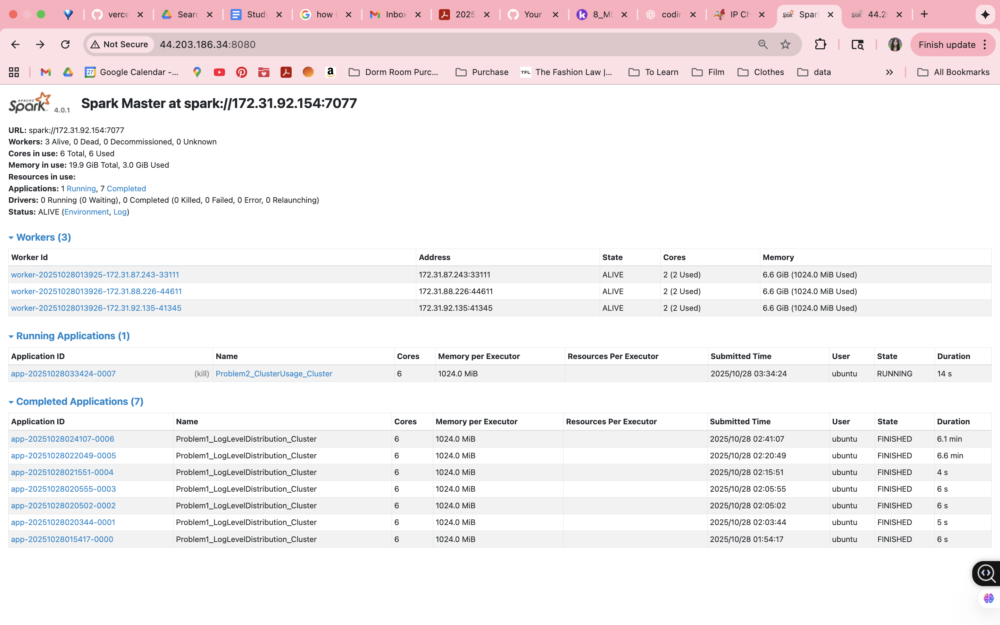
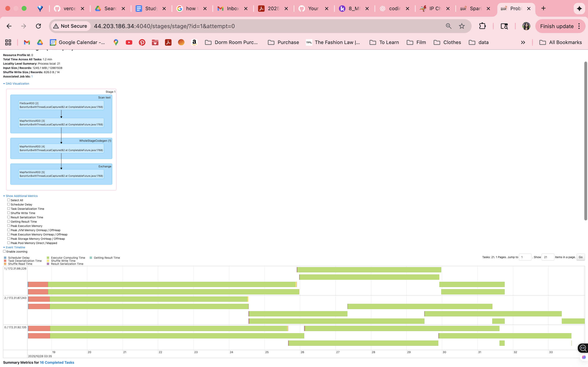

# Spark Log Analysis – Problem 1 Report

### Approach of Problem** 
For this part, I used PySpark running on a 4-node AWS Spark cluster (1 master and 3 workers).
The script (problem1.py) reads all the text log files from my S3 bucket and looks for log levels like INFO, WARN, ERROR, and DEBUG to get a sense of how many of each type appear overall.

Before deploying to the cluster, I first tested my implementation locally on the EC2 instance using a smaller subset of the log data stored under `data/sample/`.  
Running it locally made it a lot easier to debug since I could quickly check small outputs and fix issues with my regex.

At first, my regex wasn’t working right and I kept getting CSV files that were basically empty. I fixed it by testing a few lines manually and adjusting the expression until it matched all the log levels correctly. Once I saw that it worked locally, I switched over to the full dataset on the cluster. I also changed the path to use s3a:// (instead of s3://), which is what made Spark actually able to read from S3 properly.

After that, the job ran on the whole dataset with all workers reading the files in parallel, which made it much faster compared to running everything locally.

### Key Insights and Patterns

Total log lines processed: 33236604
Total lines with log levels: 27410250
Unique log levels found: 3

Log level distribution:
  ERROR :     11,183 (  0.04%)
  INFO  : 27,389,472 ( 99.92%)
  WARN  :      9,595 (  0.04%)

Almost every single log line was INFO, which makes sense because that’s what Spark usually logs for normal progress updates.
WARN and ERROR were super rare (less than 0.1%), which suggests the cluster ran pretty smoothly overall.
There weren’t any DEBUG logs at all, which is probably because those were turned off in production.

### Performance and Execution Observations 

- **Total log lines processed:** ≈ 33.2 million  
- **Lines with valid log levels:** ≈ 27.4 million  
- **Execution time:** ~ 6.6 minutes on the cluster  
- **Total files read:** ≈ 3,852 container logs from 194 applications  

The Spark UI showed that all worker nodes were being used, especially during the reading and aggregation stages. The whole process ran in multiple stages (read, regex parse, groupBy, and write to output).

### Optimizations Used
- Switched from `s3://` → `s3a://` for proper S3 access. I had to extensively debug this issue for a while. 
- Enabled Hadoop AWS and AWS SDK packages to allow distributed S3 reads.  
- Used Spark’s DataFrame API for faster operations instead of plain RDDs.
- Wrote output directly to the master node to avoid extra network writes.

# Spark Log Analysis – Problem 2 Report

### Approach of Problem
This part used the same 4-node cluster setup to look at how Spark clusters were used over time.
The script (problem2.py) reads all the container logs from my S3 bucket and extracts:
- **cluster_id** (from the file path),
- **application_id** (from the file path), and
- **timestamps** (from each log line),

It then builds a **per-application timeline** (start/end), a **per-cluster summary**, and two **visualizations** (apps per cluster; job duration distribution for the largest cluster).

Before running on the full dataset, I validated the parsing locally with `problem2_local.py` against `data/sample/` to confirm the regex for IDs and the timestamp parsing (including multiple formats via `try_to_timestamp`). After validating correctness, I scaled to the full dataset on the cluster.

### Key Insights and Patterns

- **Total unique clusters:** 6  
- **Total applications:** 194  
- **Average applications per cluster:** 32.33  

### Most heavily used clusters:
- Cluster 1485248649253 → 181 applications  
- Cluster 1472621869829 → 8 applications  
- Cluster 1448006111297 → 2 applications  
- Cluster 1474351042505 → 1 application  
- Cluster 1440487435730 → 1 application  

Cluster 1485248649253 dominated the dataset, accounting for **93% of all applications**, while the remaining clusters had minimal activity.  
This suggests that most Spark workloads were concentrated on a single, long-lived cluster, possibly used for repeated batch or iterative jobs.

The job durations were very skewed — most finished in just a few hundred seconds, but a few took over 10,000 seconds, which means there were some big outlier jobs that took a lot longer.

### Performance and Execution Observations

- **Total log lines processed:** ≈ 33 million  
- **Full cluster runtime:** ~11 minutes  
- **Executor utilization:** All three worker nodes active during parse and group stages  

When I ran it locally, it only took around a minute since I only had one small folder. Running on the full cluster dataset took a lot longer but Spark handled the distribution well. The parallel reads from S3 and distributed grouping made it way faster than doing it locally.

### Visualizations 

**Applications per Cluster** (`problem2_bar_chart.png`)  
Shows that almost all jobs were executed on cluster 1485248649253, with a small number on five minor clusters.

**Duration Distribution (Largest Cluster)** (`problem2_density_plot.png`)  
This graph shows how long jobs ran for on the main cluster. It’s log-scaled on the x-axis, and you can see most jobs finished quickly but a few took way longer.

### Optimizations Used 

- Enabled Hadoop AWS and AWS SDK connectors for `s3a://` access.  
- Used `input_file_name()` to derive cluster/application IDs efficiently.  
- Applied `try_to_timestamp()` with multiple patterns for robust date parsing.  
- Performed aggregation using the Spark SQL DataFrame API for scalability.  
- Wrote final outputs to the master node’s local disk to reduce network overhead.

### Spark Web UI Observations

- **Jobs tab:** shows sequential stage execution for parsing, grouping, and writing outputs.  
- **Executors tab:** cThis graph shows how long jobs ran for on the main cluster. It’s log-scaled on the x-axis, and you can see most jobs finished quickly but a few took way longer.

  
